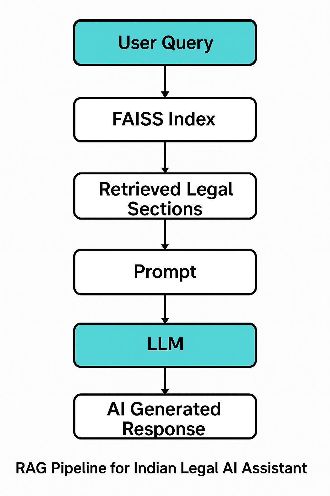

# 🇮🇳 Indian Legal Assistant RAG Bot

A Retrieval-Augmented Generation (RAG) based chatbot to provide legal help to Indian citizens using publicly available Bare Acts. It uses modern NLP techniques to retrieve relevant legal provisions and generate expert-style responses.

---

## ❓ Why This Project?

Legal issues are often complex, and finding the right legal guidance can be overwhelming and costly. Many people cannot afford legal consultations or may not know where to begin.

This chatbot offers a **free and accessible legal assistant**, trained on the **core Indian Bare Acts**, to provide relevant legal insights directly to users.

> ✅ It is **not a replacement for a lawyer**, but an assistive tool to understand legal contexts better.

---

## 📚 Acts Covered in This Chatbot

The chatbot has been trained on **8 foundational Indian laws**:

1. **Code of Criminal Procedure, 1973 (CrPC)**  
2. **Indian Penal Code, 1860 (IPC)**  
3. **Civil Procedure Code, 1908 (CPC)**  
4. **Hindu Marriage Act, 1955 (HMA)**  
5. **Indian Divorce Act, 1869 (IDA)**  
6. **Indian Evidence Act, 1872 (IEA)**  
7. **Negotiable Instruments Act, 1881 (NIA)**  
8. **The Motor Vehicles Act, 1988 (MVA)**

**Data Source**: [CivicTech-India GitHub Repository](https://github.com/civictech-India/Indian-Law-Penal-Code-Json)

---

## 🔧 RAG Pipeline (How It Works)

The chatbot works using a **Retrieval-Augmented Generation** pipeline that combines vector similarity search with LLM reasoning:

1. **Preprocessing**:
   - JSONs of Bare Acts are cleaned and normalized.
   - Each section's title and content are combined as text.

2. **Embedding & Indexing**:
   - Texts are embedded using the `all-MiniLM-L6-v2` SentenceTransformer.
   - A FAISS index is built for fast similarity search.

3. **Query Processing**:
   - User query is converted into an embedding.
   - FAISS retrieves top-matching sections.

4. **Prompt Building**:
   - Retrieved law texts are compiled into a legal context.
   - Prompt is constructed for LLM inference.

5. **Answer Generation**:
   - Groq's LLM (`deepseek-r1-distill-llama-70b`) generates a concise legal opinion based only on retrieved texts.

6. **Output Saving**:
   - The chatbot saves the entire interaction (query, context, response) into timestamped `.txt` files.

---

## 📊 Pipeline Diagram


---

## 📁 Repository Structure

```
legal_assistant_rag/
├── JSONS/                     # Contains 8 Bare Acts as JSON files
├── JSONS_embedding/          # FAISS index + embeddings + metadata
│   ├── faiss_index
│   └── faiss_index_meta.pkl
├── legal_outputs/            # Output folder with saved response text files
├── RAG_pipeline.png          # Visual diagram of RAG pipeline
├── RAG_pipeline.md           # Text description of the RAG pipeline
├── Data_Source.txt           # Attribution to dataset source
├── Lawer_chatBot.py          # Main chatbot script
├── Lawer_ChatBot.ipynb       # Jupyter notebook version (optional)
├── embedding_and_indexing_generator.py  # Preprocessing + Embedding + FAISS indexing
```

---

## ⚙️ Code Overview (What Each Script Does)

- `embedding_and_indexing_generator.py`
  - Preprocesses all JSON files in the `JSONS/` directory.
  - Embeds each section using a transformer model.
  - Builds a FAISS index and stores metadata for retrieval.

- `Lawer_chatBot.py`
  - Loads the index and model.
  - Accepts user queries through the CLI.
  - Performs retrieval, constructs prompts, generates legal advice.
  - Saves each session's output in `legal_outputs/`.

---

## 📦 Requirements

Install the following Python packages:

```bash
pip install faiss-cpu sentence-transformers groq
```

Make sure to set your `GROQ_API_KEY` inside `Lawer_chatBot.py`.

---

## 🛡️ Disclaimer

This chatbot provides **informational support only** and is not a substitute for professional legal consultation. It uses publicly available data and does not guarantee legal validity.

---

## 📬 Contact

Project by: [Abhisek Sarkar](https://github.com/abhiseksarkar2001)

Contributions, suggestions, and improvements are welcome!

---

